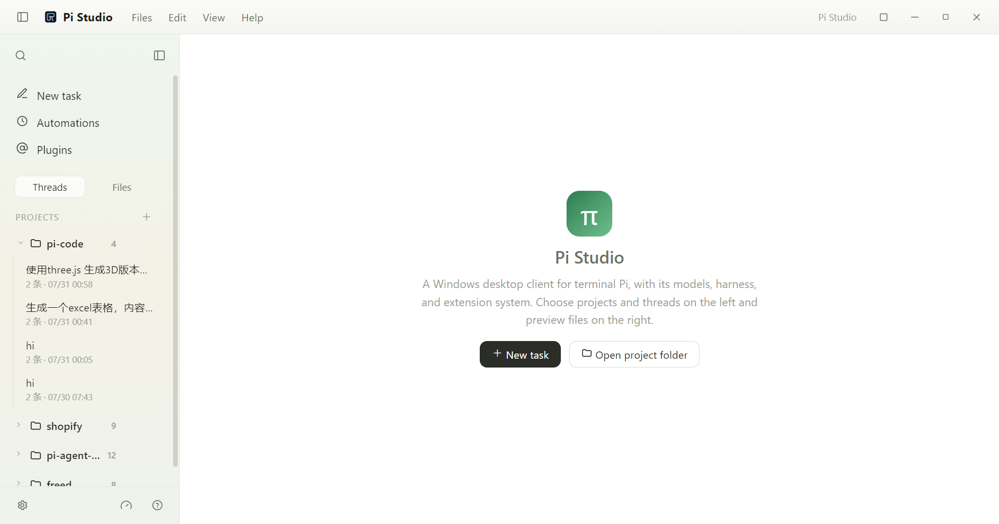

# Omp Studio

**中文** | [English](README.en.md)

Omp Studio 是 [oh-my-pi](https://github.com/can1357/oh-my-pi)（omp，[Pi 编程代理](https://github.com/earendil-works/pi) 的一个分支）的独立 Electron 桌面客户端。它把 omp 的项目、会话、模型配置、扩展、权限控制、自动化与文件预览整合到一个桌面工作区中。

当前版本：`0.5.9`（Windows x64 与 macOS arm64 安装包）。

> Omp Studio 是一个独立的社区项目，与 Pi 或 oh-my-pi 维护者无隶属关系，也未获得其背书。

## 功能特性

- 在桌面侧边栏中管理本地项目与会话。
- 流式对话，可配置模型与思考等级。
- 阅读并预览 Markdown、HTML、源代码、图片以及常见办公文档。
- 通过 omp 共享的 `models.yml` 配置提供方与模型。
- 使用共享 agent 目录中的 omp 扩展与技能。
- 定时执行自动化任务，可显式选择沙箱或完全访问权限。
- 每个安装包内置固定版本的 omp 运行时，并支持应用内运行时更新。
- 对 shell 命令、项目边界与扩展操作启用权限门控。

## 截图



## 下载

从 GitHub Releases 下载最新的 Windows x64 `Omp-Studio-Setup-<版本>.exe` 或 Apple Silicon macOS `Omp-Studio-<版本>-arm64.dmg`。安装包目前未签名，因此 Windows SmartScreen 或 macOS Gatekeeper 可能会弹出警告。

在 macOS 上，将应用拖入 `/Applications` 后，请先清除隔离标记再首次启动：

```bash
sudo xattr -cr /Applications/Omp\ Studio.app
```

每个安装包都内置了固定版本的 omp 原生运行时。首次启动时，Omp Studio 会校验并把内置运行时复制到用户数据目录。后续应用更新会复用已解压的运行时，无需再下载。

## 开发环境要求

- 打包目标平台为 Windows x64 与 macOS arm64。
- 开发与打包需要 Node.js `24.14.0` 及以上（Node 24 大版本内）。
- npm。
- 无需全局安装 Pi：`npm run bundle` 会从 GitHub Releases 下载固定版本的 oh-my-pi（omp）运行时二进制（版本见 `package.json` 中的 `ompRuntimeVersion`）。只有在免打包直接跑开发模式时，才需要系统级安装 `omp`。

## 开发

```powershell
npm install
npm run typecheck
npm run test:permission
npm run dev
```

常用命令：

```powershell
npm run build             # 构建 Electron 应用
npm run bundle            # 构建安装包内置的运行时归档
npm run dist              # bundle + build + 生成安装包
npm run pack              # 生成未打包的目录构建
```

构建产物输出到 `release/`。`npm run dist` 会生成内置 omp 运行时二进制的 Electron 安装包；`release/` 中生成的二进制用于 QA，无需单独上传。仓库在 `package.json`（`ompRuntimeVersion`）中固定了 omp 运行时 `17.2.12`，打包脚本会在下载前校验该版本与 GitHub 最新发布是否一致。设置 `OMP_RUNTIME_VERSION` 可打包其他固定版本。

## 配置与数据

Omp Studio 共享 oh-my-pi 的 agent 配置目录 `~/.omp/agent`，包括模型、提供方、认证、扩展与会话设置。桌面应用自身的设置存储在 Electron 的用户数据目录中。

API 密钥属于用户数据。请勿向本仓库提交 `auth.json`、`models.json`、会话文件、包含密钥的截图或本地配置目录。

## 权限与安全

omp 可以读写项目文件并代表用户执行工具。Omp Studio 默认以沙箱模式启动新会话；完全访问权限必须为会话或自动化任务显式选择。这些控制可以降低误操作风险，但不能替代操作系统级隔离与人工审查。

请勿在公开的 issue、PR、截图或示例文件中粘贴 API 密钥等敏感信息。如发现安全问题，请先通过 GitHub 私下联系维护者，再公开披露。

## 贡献

欢迎提交 bug 报告与 PR。提交变更前请确认：

1. 变更聚焦、可解释对用户可见的行为。
2. 运行 `npm run typecheck`。
3. 涉及权限或工具执行代码时运行 `npm run test:permission`。
4. 不包含本地数据、生成的包、安装包、凭据或 QA 浏览器配置。

## 第三方软件

Omp Studio 使用了 Electron、React、Vite、oh-my-pi（omp）、Node.js 等开源软件包。组件清单与许可证请参阅 [THIRD_PARTY_NOTICES.md](THIRD_PARTY_NOTICES.md)。

## 许可证

Omp Studio 源代码以 [MIT 许可证](LICENSE) 授权。

Pi 名称、项目名、Logo 及其他商标归其各自所有者所有。MIT 许可证不授予商标权。
